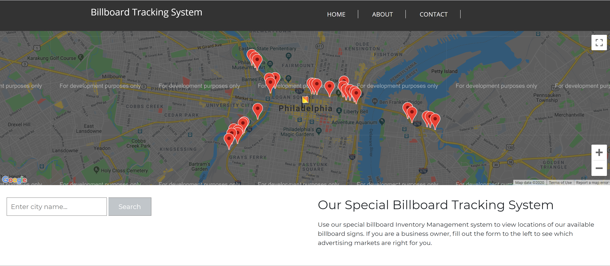

# Project Title
Billboard Finder

# Introduction
Billboard Finder is a web application designed to provide location information about billboard advertising space as well as demographic data for the user's chosen geographic area. Our users are mainly business owners and their associates looking to find ideal ad space for their organization. 

# Project Description / Overview
As students at UPenn, our development team is comprised of three individuals with various professional backgrounds and skillsets. Our development process started with planning out what we wanted to create at a high level and we created our user story based on our discussion. From there, we broke out the project work into buckets and assigned ourselves to those high level tasks. We had daily stand-ups where we would discuss our approach to our current work, and would discuss our future implementation ideas. We wanted to have each team member focus on one task at a time as we wanted to keep it simple enough so that if we started down a path that wasn't ideal, we would fairly easily be able to course correct. We tested our own code as we went along, and will run a form of regression testing after our code freeze on the night of Saturday 1/11/20, making any minor tweaks to existing features and fixing any low-risk bugs before delivery on Tuesday 1/14/20. 

# Usage

 The page will load and display a map with billboard location data for Philadelphia, PA (Note: this is currently hard coded. A future release of Billboard Finder will allow searching of user-input geographies). When the user clicks the button on the page, they will be presented with demographic data from arcGIS API about Philadelphia, PA. The user can click on the map dots to see data about that billboard location.   

 

 #### Link to webapp:  https://dp95000.github.io/group-project-1/

